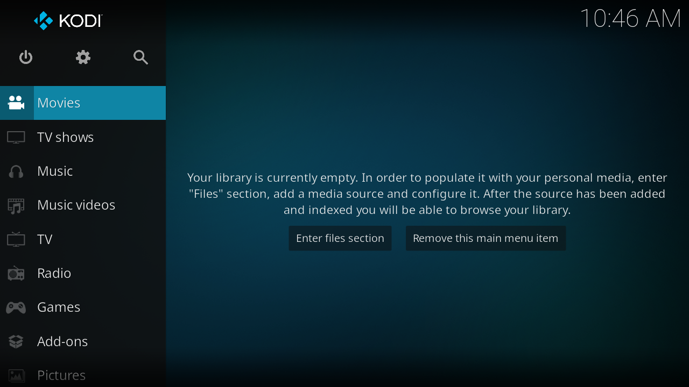
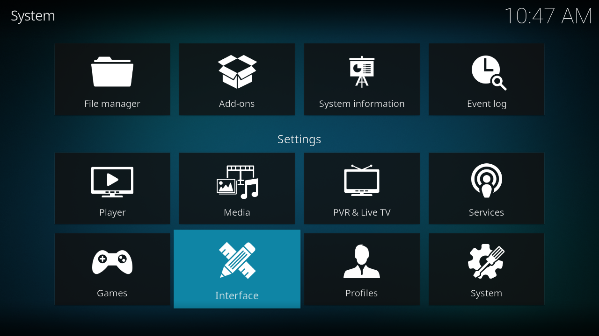
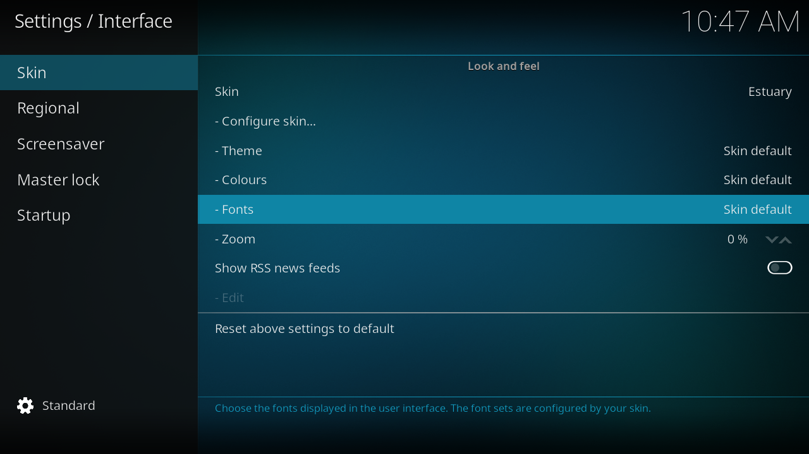
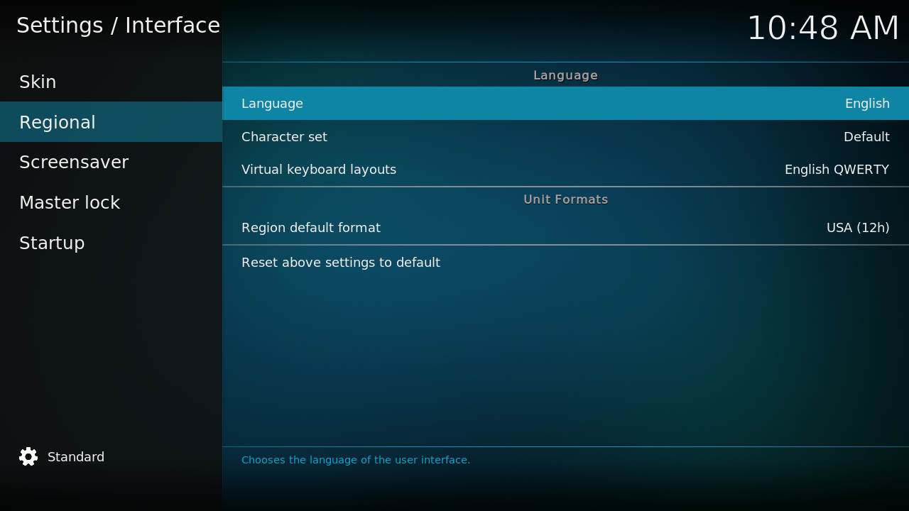
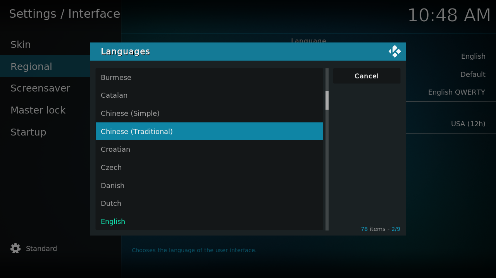

## KODI下載與中文化
***
如果您使用Android TV，到Google Play商店[下載KODI](https://play.google.com/store/apps/details?id=org.xbmc.kore)

其他作業系統到[KODI官方網站](https://kodi.tv/)下載
***
若不偏好看圖文，可參考[這個影片](https://youtube.com/watch?v=W587eTNZlCU)
***
進入KODI後的介面

- 中文化
移至設定(齒輪圖標)，點選Interface

Skin > Fonts設為Arial Based

Regional > Language設為Chinese(Traditional)

