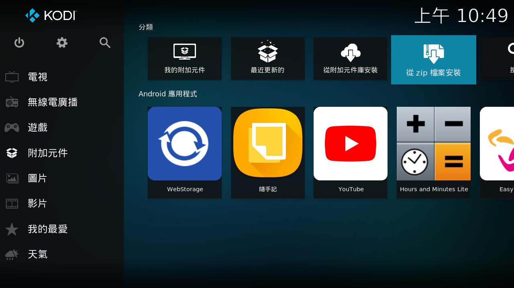
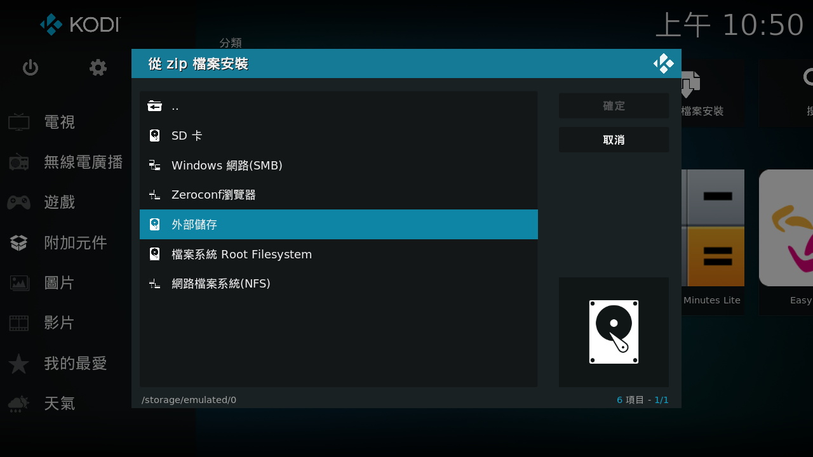
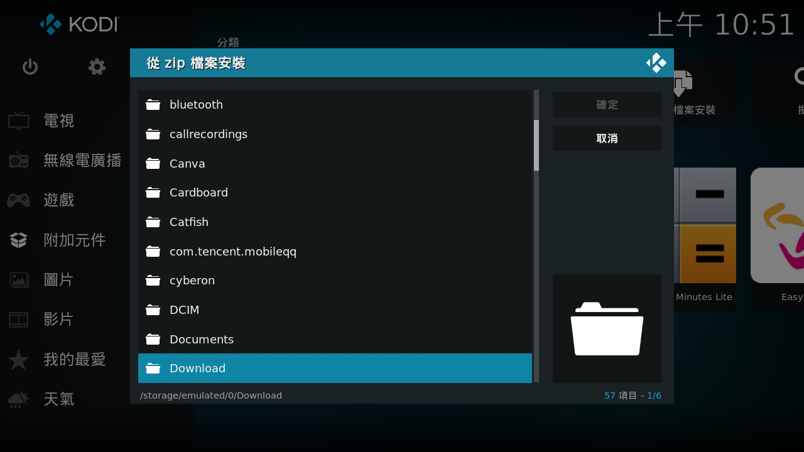
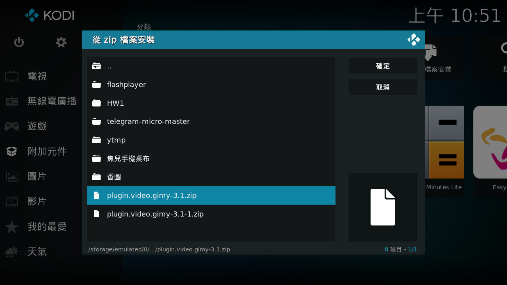
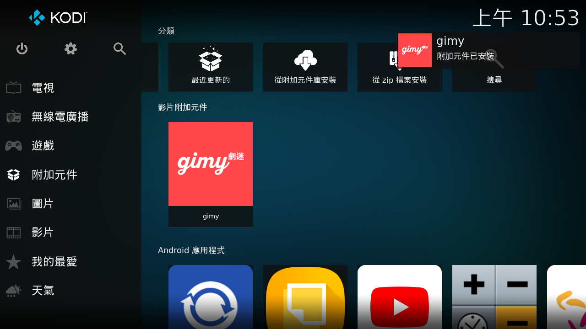
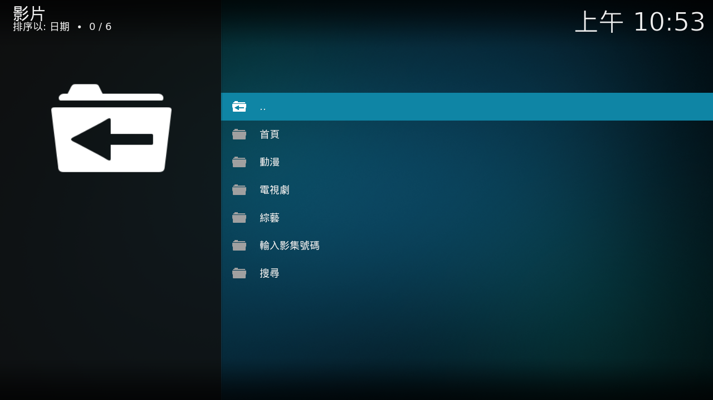
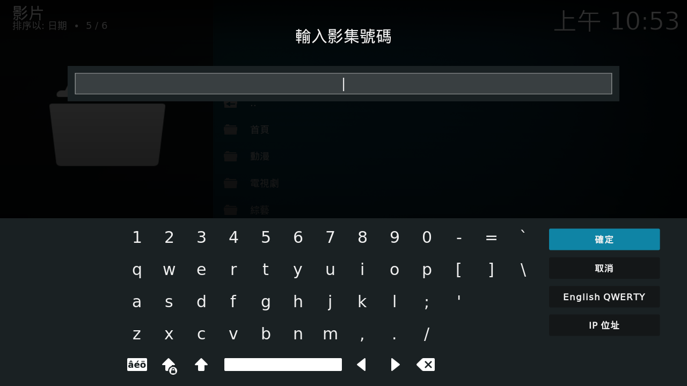

# Gimy.app for KODI
---
如果您從未使用過或不知道什麼是KODI，請看[這裡](Base.md)
***
## 簡介
這是一個在電視上使用KODI觀看gimy.app影視的插件，不再需要使用滑鼠或滑鼠模式在電視上操作gimy.app網頁
***
## 安裝
### 點選這裡[下載](https://github.com/Natsuhane-Ayari/plugin.video.gimy/releases/download/v4.5/plugin.video.gimy-4.5.zip)插件Zip檔

進入KODI的附加元件分頁，移至**從Zip檔安裝**

移至**外部儲存**

※通常會在Download資料夾

選取下載好的Zip檔

等它一段時間，安裝完成後就會出現在畫面上

起始頁面

※搜尋功能可用，但KODI尚未支援注音輸入，也沒有繁體，可以使用[Kore](https://play.google.com/store/apps/details?id=org.xbmc.kore)操控KODI，以及發送文字

或使用影集號碼，目前只支援[gimy.app](https://gimy.app/)，尚未支援其他站台

※影集號碼為網址後面的一串數字※

